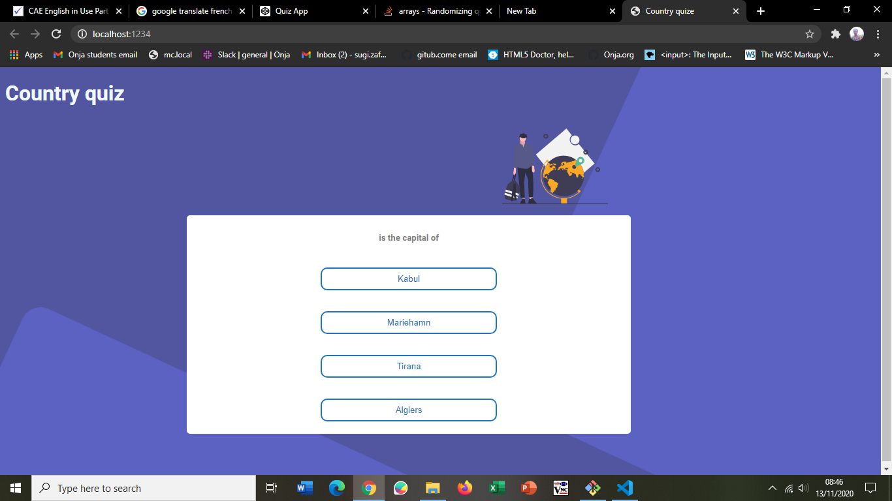

<!-- Please update value in the {}  -->

<h1 align="center">Country quiz</h1>

<div align="center">
  <h3>
    <a href="https://country-quiz-sugi.netlify.app">
      Demo
    </a>
    <span> | </span>
    <a href="https://{your-url-to-the-solution}">
      Solution
    </a>
  </h3>
</div>

<!-- TABLE OF CONTENTS -->

## Table of Contents

-   [Overview](#overview)
    -   [Built With](#built-with)
-   [Features](#features)
-   [How to use](#how-to-use)
-   [Contact](#contact)
-   [Acknowledgements](#acknowledgements)

<!-- OVERVIEW -->

## Overview



Introduce your projects by taking a screenshot or a gif. Try to tell visitors a story about your project by answering:

-   Where can I see your demo?
  ## My experience 

    -    

  ## What have you learned/improved?


  ## Your wisdom? :)

  -    This is most difficult project a hve ever done so that I didn,t eve know how to start. I didn't even know how to start. I tried to think of what I really don't understand but I don't know till the time I'm writting this note. 

  -    I'm really sorry for achieving nothing in my project, it does not mean that I don't care but I really don't anything. 

### Built With

<!-- This section should list any major frameworks that you built your project using. Here are a few examples.-->

-   [React](https://reactjs.org/)

## Features

<!-- List the features of your application or follow the template. Don't share the figma file here :) -->

## How To Use

<!-- Example: -->

To clone and run this application, you'll need [Git](https://git-scm.com) and [Node.js](https://nodejs.org/en/download/) (which comes with [npm](http://npmjs.com)) installed on your computer. From your command line:

```bash
# Clone this repository
$ git clone https://github.com/your-user-name/your-project-name

# Install dependencies
$ npm install

# Run the app
$ npm start
```

## Acknowledgements

<!-- This section should list any articles or add-ons/plugins that helps you to complete the project. This is optional but it will help you in the future. For example: -->

## Contact

-   Website [your-website.com](https://country-quiz-sugi.netlify.app)
-   GitHub [@your-username](https://github.com/vahona/country-quiz)

